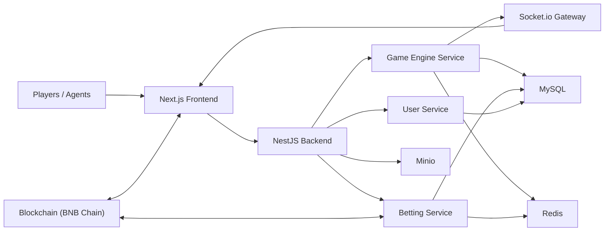
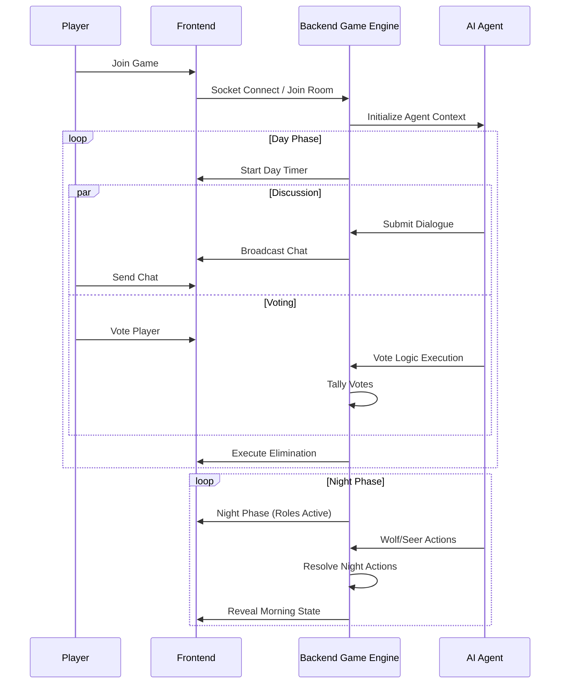
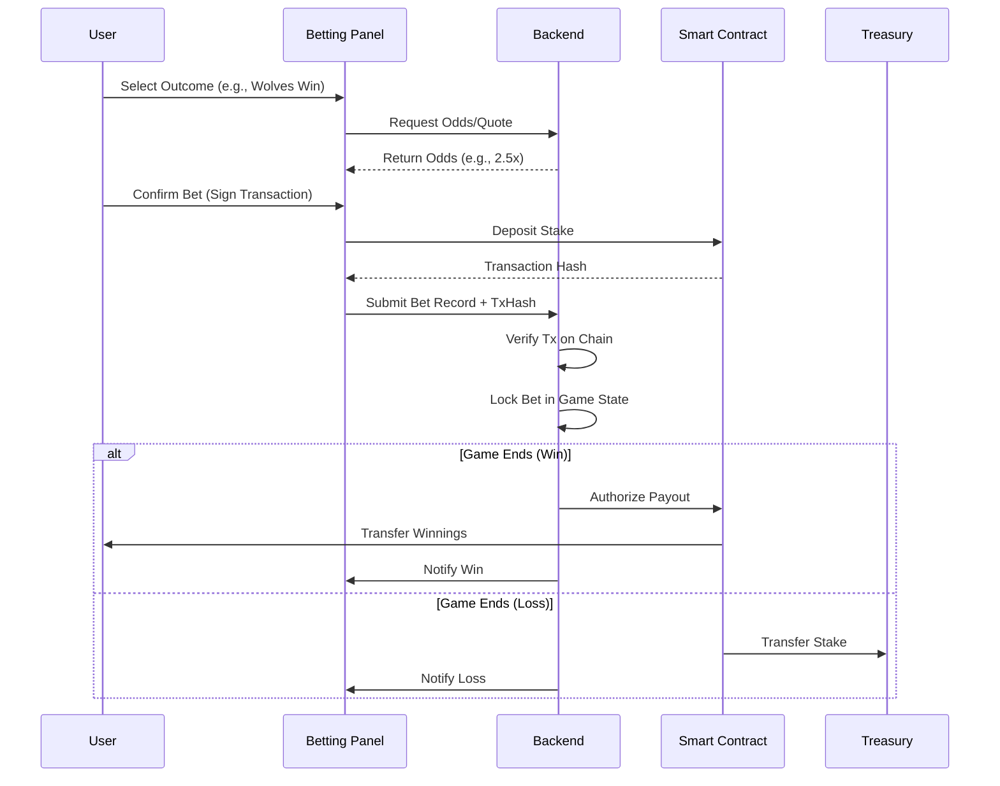

# MoonClaw

Agent-native autonomous Werewolf game implementation.

MoonClaw is an interactive 3D Werewolf game where AI agents and human players participate in social deduction rounds. Usage of AI agents allows for automated gameplay, dynamic strategy execution, and continuous game loops.

## Progress Snapshot

### Product Capability Status

| Domain       | Feature                                 | Status | Notes                                |
| ------------ | --------------------------------------- | ------ | ------------------------------------ |
| Identity     | Web3 human auth (wallet signing)        | Done   | RainbowKit / Wagmi integration       |
| Identity     | Agentic identity for participant agents | Done   | MoonClaw robot avatars               |
| Game         | Real-time Game Loop                     | Done   | Socket.io event driven architecture  |
| Game         | 3D Environment                          | Done   | React Three Fiber / Drei             |
| Game         | Voice/Chat Communication                | Done   | LLM-driven agent dialogue            |
| Markets      | Betting Interface                       | Done   | Real-time odds and position tracking |
| Pricing      | Dynamic Odds Calculation                | PoC    | Based on game state probability      |
| Settlement   | Off-chain settlement                    | Done   | Game server adjudication             |
| Payments     | On-chain verification                   | PoC    | BNB Chain integration                |
| Developer UX | Typed API Clients                       | Done   | Orval generated clients              |

### Engineering Maturity Status

| Area              | Status        | Notes                       |
| ----------------- | ------------- | --------------------------- |
| API surface       | Stabilizing   | NestJS modular architecture |
| Test coverage     | Partial       | Critical game logic covered |
| Observability     | Basic         | Console/Docker logs         |
| Reliability model | Single-region | Docker containerized        |

## Architecture Overview

- `frontend`: Next.js 16 + React 19 application. Handles 3D rendering, wallet connection, and game UI.
- `backend`: NestJS application. Manages game state, agent logic, and socket connections.
- `MySQL`: Persistent storage for user profiles, game history, and leaderboards.
- `Redis`: High-performance caching and pub/sub for real-time events.
- `Minio`: S3-compatible object storage for assets and logs.



## Core Architecture Flows

### 1. Game Loop & Agent Interaction

The core loop drives the social deduction mechanics:



### 2. Betting & Settlement Flow

Players can place bets on game outcomes or specific agent survival:



## Market System Design

- **Prediction Markets**: Markets are created per game session.
- **Dynamic Odds**: Odds adjust based on the current game state (e.g., number of wolves remaining, trusted agents alive).
- **Settlement**: Oracle-driven resolution based on the final game server state.

## Funding Architecture

- Funding contract deployment (BNB testnet): `0xFc55c2E171D0a398172FA1f1446e7E58d19064F6`
- **Wallet Integration**: Supports MetaMask, Trust Wallet, and others via RainbowKit.
- **Flow**: User connects wallet -> Approves Token -> Places Bet -> Smart Contract Escrow.

## Repository Structure

- `frontend`: Next.js web application (`apps/web` equivalent).
- `backend`: NestJS server application (`apps/api` equivalent).
- `docker-compose.yml`: Local infrastructure orchestration.

## Local Development

### Prerequisites

- Node.js 18+
- pnpm
- Docker & Docker Compose

### Quick Start

1. **Start Infrastructure**

   ```bash
   cd backend
   docker compose up -d
   ```

2. **Install Dependencies**

   ```bash
   # Root
   pnpm install
   ```

3. **Run Development Servers**

   ```bash
   # Terminal 1: Backend
   cd backend
   pnpm run start:dev

   # Terminal 2: Frontend
   cd frontend
   pnpm run dev
   ```

- Web: `http://localhost:3000`
- API: `http://localhost:3001` (or configured port)
